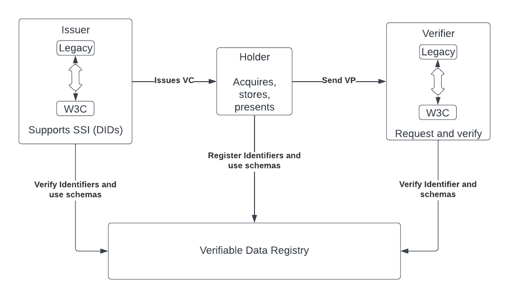

# Anoncreds W3C Compatibility

This design proposes to extend the Aries Cloud Agent Python (ACA-Py) to support Hyperledger AnonCreds credentials and presentations in the W3C Verifiable Credentials (VC) and Verifiable Presentations (VP) Format.
The aim is to transition from the legacy AnonCreds format specified in [Aries-Legacy-Method](https://hyperledger.github.io/anoncreds-methods-registry/#hyperledger-indy-legacy-anoncreds-method) to the W3C VC format.


## Overview

We aim to wrap the enhancements made on the RUST Framework [Anoncreds Rust](https://github.com/hyperledger/anoncreds-rs) first, the integration of AnonCreds with W3C VC Format in ACA-Py, which includes support for issuing, verifying, and managing W3C VC Format AnonCreds credentials.

Also, we're emphasizing cryptographic agility and advanced storage capabilities, enabling multiple signature types, ensuring smooth integration with DIDComm Protocol alignments within ACA-Py, and making the framework interoperable with the Javascript Framework [Document](https://github.com/hyperledger/aries-framework-javascript).


## Caveats (or What's out of scope)

We will only target compatibility with VCDM (Verifiable Credential Data Model) 1.1 because, primarily, the Python framework is going to be a wrapper on the RUST implementation and would support the features being implemented in the RUST frameworks, which include:

* Credentials: Verify validity of non-Creds Data Integrity proof signatures
* Presentations: Create presentations using non-AnonCreds Data Integrity proof signature
* Presentations: Verify validity of presentations, including non-AnonCreds Data Integrity proof signatures
* Presentations: Support different formats (for example, DIF) of Presentation Request

This is also because VCDM (Verifiable Credential Data Model) 2.0 implementations are not mature enough for interop yet.

## Key Questions

### How will these functions be exposed in Acapy?

These Python functions will call the Rust functions through a foreign function interface (FFI), such as ctypes or cffi. Here's how we would likely do it:

1. Import the necessary modules for FFI.
2. Define the Python functions that call the Rust functions.
3. Use the Rust library where these functions are defined.
   The following PR contains the functions we would be using FFI on
   `https://github.com/hyperledger/anoncreds-rs/pull/271`
   `https://github.com/hyperledger/anoncreds-rs/pull/273`
   `https://github.com/hyperledger/anoncreds-rs/pull/274`
   `https://github.com/hyperledger/anoncreds-rs/pull/276`
   
Since the Rust functions are using `ObjectHandle` and `ErrorCode`, we would need to have equivalent representations in Python. For simplicity, I'll assume `ObjectHandle` is an integer and `ErrorCode` is an integer representing the error status.

### Will you write helper methods that are even higher-level than these six functions?


```py
import ctypes

# Assuming the Rust library is compiled to a shared library named 'rust_lib.so'
rust_lib = ctypes.CDLL('./rust_lib.so')

# Define the ObjectHandle and ErrorCode types in Python
ObjectHandle = ctypes.c_int
ErrorCode = ctypes.c_int

# Here's the Python wrapper for `anoncreds_credential_to_w3c`
def anoncreds_credential_to_w3c(cred):
    cred_p = ObjectHandle()
    result = rust_lib.anoncreds_credential_to_w3c(cred, ctypes.byref(cred_p))
if result!= 0:
        raise Exception(f"Error code: {result}")
    return cred_p.value

# Here's the Python wrapper for `anoncreds_credential_from_w3c`
def anoncreds_credential_from_w3c(cred):
    cred_p = ObjectHandle()
    result = rust_lib.anoncreds_credential_from_w3c(cred, ctypes.byref(cred_p))
if result!= 0:
        raise Exception(f"Error code: {result}")
    return cred_p.value

```

In the above sample Python code:

- rust_lib.anoncreds_credential_to_w3c and rust_lib. and
anoncreds_credential_from_w3c are the Rust functions exposed to Python.
  
- `ObjectHandle` is used to store the reference to the credential object.
ctypes.byref(cred_p) is used to pass a pointer to the ObjectHandle.
  
The functions return the converted credential's ObjectHandle value if successful or raise an exception if there's an error.

### Will you write helper methods that are even higher-level than these six functions?

Even though we write higher-level helper methods, they can help in the following areas:


Abstraction Level: If the goal is to provide Python developers with an API that abstracts away the lower-level details and complexities of credential manipulation, then higher-level helper methods would be beneficial. These methods could combine multiple lower-level operations into a single, more user-friendly function.
**For example:**

In comparing lower-level and higher-level approaches in a library for handling user authentication, the lower-level approach offers basic functions like `create_user`, `get_user`, `update_password`, and `delete_user`, which map directly to specific database operations and provide fine-grained control but require more understanding of these operations. In contrast, a higher-level abstraction simplifies usage by encapsulating multiple steps into user-friendly functions such as `register_new_user`, `change_user_password`, and `remove_user_account`. These methods handle additional complexities like password hashing and user verification internally, making the library easier to use and reducing the likelihood of errors, albeit at the cost of reduced flexibility compared to the more complex, lower-level methods. This higher-level approach is especially beneficial for developers not familiar with the underlying systems, offering a more streamlined API.


### Compatibility with AFJ: How will you make sure that you are compatible?

Use Case Specificity: If there are common patterns or use cases in the application of these functions, higher-level methods can be tailored to these patterns, simplifying the development process for users.

Ease of Use: Higher-level methods can provide a more Pythonic interface, making the framework easier to use for Python developers who might not be familiar with the intricacies of Rust or FFI.

Performance Considerations: Higher-level methods could optimize certain operations by reducing the number of FFI calls, which might be beneficial for performance-critical applications.

Error Handling and Validation: Providing higher-level methods allows for centralized error handling and input validation, potentially leading to more robust and secure code.

Maintenance and Extensibility: Higher-level methods could make the framework easier to maintain and extend, especially if the underlying Rust implementation changes over time.

The writing of these higher-level helper methods into the Academia depends generally on the intended audience need **[Gov of BC]**, use cases, and design goals of the Python framework, and it's something we will likely write if required.

### Do any new admin functions need to be built on the control channel?

Since we'll be adding W3C compatibility to the aries cloudagent, we will likely be adding some functions to support and manage the features being implemented in the Rust framework.

Here's a brief overview and examples:

Credential Verification Management: Admin functions could be required for managing and verifying the validity of non-AnonCreds Data Integrity proof signatures. This might include configuring validation parameters or viewing verification logs.

Presentation Creation and Verification: Functions to manage the creation and verification of presentations, including those with non-AnonCreds Data Integrity proof signatures, will be crucial. This could involve setting up templates or guidelines for presentation formats and viewing verification results.

Format Support Flexibility: With the support for different presentation request formats, such as DIF, admin functions could be needed to configure and manage these formats. This might include the ability to switch between formats or customize the request parameters for each format.

### Compatibility with AFJ: How will you make sure that you are compatible?

In order to achieve compatibility between Aries Cloud Agent Python (ACA-Py) and the Aries Framework JavaScript (AFJ), it will involve several key steps and considerations. The goal is to achieve interoperability between these two implementations of the Aries protocols. Here are some strategies and aspects to focus on:

**Follow Aries RFCs**: We have to ensure Both ACA-Py and AFJ adhere strictly to the Aries RFCs (Request for Comments). These RFCs define protocols, data models (W3c DM), and interfaces for various Aries features. Consistent implementation of these RFCs is crucial for interoperability.

**Test Suites and Interoperability Testing**: We'll Implement comprehensive test suites that cover all aspects of the Aries protocols. Regular interoperability testing between ACA-Py and AFJ can help identify and resolve compatibility issues. 
   
**DIDComm Protocol Compatibility**: Ensure that both ACA-Py and AFJ are compatible with the same versions of the DIDComm protocol, as this protocol is central to agent communication in Aries.

**Coordinate with the Hyperledger Aries Community**: Engage with the wider Hyperledger Aries community for insights, guidelines, and best practices. This can help in staying aligned with the latest developments and standards.

**Use Common Libraries Where Possible**: For functionalities like cryptographic operations, we'll consider using common libraries or defining standards that both ACA-Py and AFJ can implement. This helps in maintaining consistency in key operations.

**Documentation and Examples**:We would provide clear documentation and examples showing how to achieve interoperability. This can include sample configurations and detailed guidance on setting up ACA-Py locally and also on production.

**Feature Parity and Extensions**: We'll strive for feature parity between ACA-Py and AFJ. Where there are extensions or unique features in one implementation, we'll reach out to the AFJ Team to consider how they can be supported or handled in the it.

**Community Feedback and Collaboration**: Actively seek feedback from developers and users who work with both ACA-Py and AFJ. Collaborative development and issue resolution can significantly enhance compatibility.

We can majorly achieve this interoperability, by making sure we're implementing based on requirements specified, and updating the Javascript team on new features implemented, we can achieve compatibility between the two frameworks.

### Examples

#### Example of an AnonCreds W3C credential:

```json
{
  "@context": [
    "https://www.w3.org/2018/credentials/v1",
    "https://raw.githubusercontent.com/DSRCorporation/anoncreds-rs/design/w3c-support/docs/design/w3c/context.json"
  ],
  "type": [
    "VerifiableCredential",
    "AnonCredsCredential"
  ],
  "issuer": "did:sov:3avoBCqDMFHFaKUHug9s8W",
  "issuanceDate": "2023-10-26T01:17:32Z",
  "credentialSchema": {
    "type": "AnonCredsDefinition",
    "definition": "did:sov:3avoBCqDMFHFaKUHug9s8W:3:CL:13:default",
    "schema": "did:sov:3avoBCqDMFHFaKUHug9s8W:2:basic_person:0.1.0",
    "encoding": "auto"
  },
  "credentialSubject": {
    "firstName": "Alice",
    "lastName": "Jones",
    "age": "18"
  },
  "proof": [
    {
      "type": "CLSignature2023",
      "signature": "AAAgf9w5.....8Z_x3FqdwRHoWruiF0FlM"
    },
    {
      "type": "Ed25519Signature2020",
      "created": "2021-11-13T18:19:39Z",
      "verificationMethod": "did:sov:3avoBCqDMFHFaKUHug9s8W#key-1",
      "proofPurpose": "assertionMethod",
      "proofValue": "z58DAdFfa9SkqZMVPxAQpic7ndSayn1PzZs6ZjWp1CktyGesjuTSwRdoWhAfGFCF5bppETSTojQCrfFPP2oumHKtz"
    }
  ]
}
```

#### Example of an AnonCreds W3C presentation [RUST EXAMPLE]:

```json
{
  "@context":[
    "https://www.w3.org/2018/credentials/v1",
    "https://raw.githubusercontent.com/DSRCorporation/anoncreds-spec/w3c-credentials/data/anoncreds-w3c-context.json"
  ],
  "type":[
    "VerifiablePresentation",
    "AnonCredsPresentation"
  ],
  "verifiableCredential":[
    {
      "@context":[
        "https://www.w3.org/2018/credentials/v1",
        "https://raw.githubusercontent.com/DSRCorporation/anoncreds-spec/w3c-credentials/data/anoncreds-w3c-context.json"
      ],
      "type":[
        "VerifiableCredential",
        "AnonCredsCredential"
      ],
      "credentialSchema": {
        "type": "AnonCredsDefinition",
        "definition": "did:sov:3avoBCqDMFHFaKUHug9s8W:3:CL:13:default",
        "schema": "did:sov:3avoBCqDMFHFaKUHug9s8W:2:basic_person:0.1.0",
        "encoding": "auto"
      },
      "credentialSubject":{
        "firstName":"Alice",
        "age":{
          "type":"AnonCredsPredicate",
          "p_type":">=",
          "p_value":18
        }
      },
      "issuanceDate":"2023-11-15T10:59:48.036203Z",
      "issuer":"issuer:id/path=bar",
      "proof":{
        "type":"AnonCredsPresentationProof2023",
        "mapping":{
          "predicates":["predicate1_referent"],
          "revealedAttributeGroups":[],
          "revealedAttributes":["attr1_referent"],
          "unrevealedAttributes":[]
        },
        "proofValue":"eyJzdWJfcHJvb2Yi...zMTc1NzU0NDAzNDQ0ODUifX1dfX19"
      }
    }
  ],
  "proof":{
    "type":"AnonCredsPresentationProof2023",
    "challenge":"413296376279822794586260",
    "proofValue":"eyJhZ2dyZWdhdGVkIjp7ImNfaGFzaCI6IjEwMT...IsMzAsMTM1LDE4MywxMDcsMTYwXV19fQ=="
  }
}
```


## Diagram representation 


